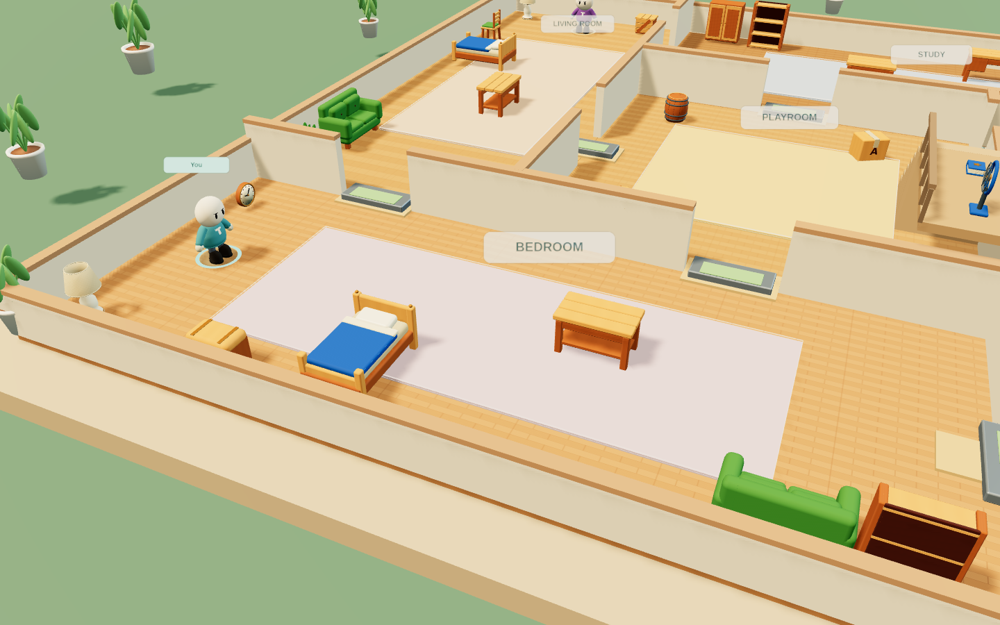
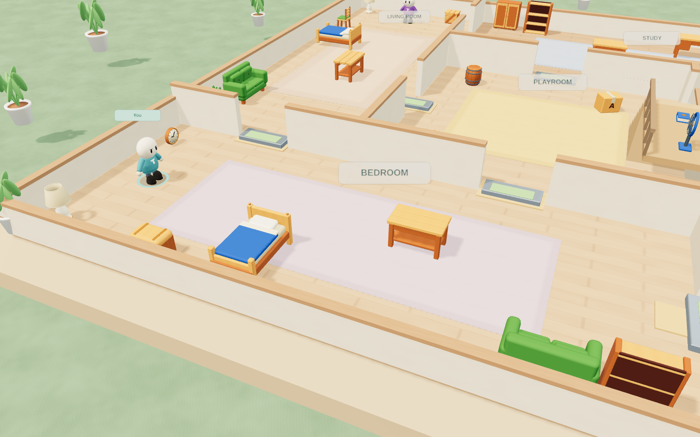
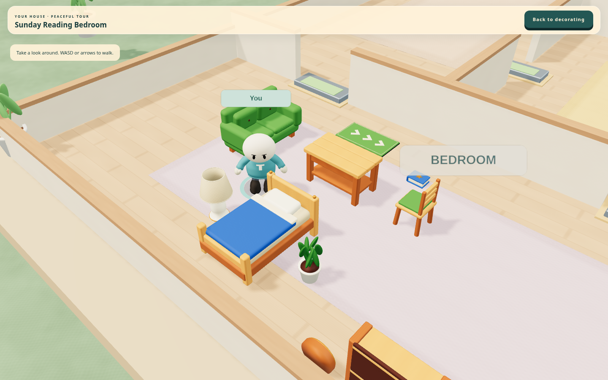

# Workshop visual review, 2026-10-01

The screenshots below are actual supplied meshes rendered by the game. The
before/after pair uses identical layout, camera, original assets and frozen
simulation. The baseline is the pre-Workshop/tactile renderer with current game
data; it is not an earlier whole-game build. UI is hidden equally for inspection.
[Recorded cameras and geometry controls](../reviews/evidence/workshop-same-camera-art.json)
include source hashes and confirm matching scene items and cameras.

The updated floor reads as wider wooden boards rather than a dense repeated grid.
Grass has surface variation, rug edges are softer, and the lamp shade has a subtle
woven finish. Furniture retains its authored colours, maps and silhouettes. The
result remains a bright stylized miniature house: the materials are very clean,
foliage is rounded and repeated, and close-camera room labels can dominate nearby
props. Surface realism remains **5/10** in the supplied-art assessment; these
images do not justify calling the game photorealistic or raising its overall
quality rating. Cohesion **7/10** and object recognition **8/10** remain useful
scoped ratings, not certification of a complete native release.

This room was imported through the actual Workshop JSON UI, saved and opened with
Save & explore. All ten supplied decor models are grounded at y=0. The close camera
and frozen simulation are deliberate inspection settings, not the default tour
view or a performance benchmark. Room layout is included in the evidence for
reproduction. Normal Pinwheel still has its authored balcony/stairs and appliances;
the empty editable shell omits them and uses flat floors in both editions.

The full renderer run also inspected mobile portrait/landscape and touch controls.
Those are Chromium touch emulation, not physical phone/native Unity execution.
Native material/shader variant rendering and device frame-time remain open gates.
The new surface maps are procedural raster shader details, not new generated 3D
meshes. The original assets and their earlier interchange verification are retained.
